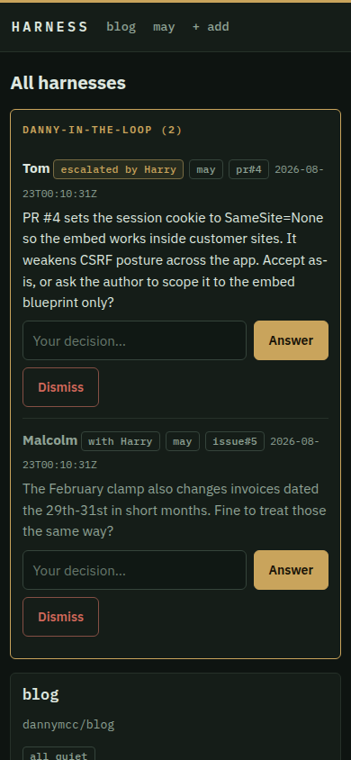
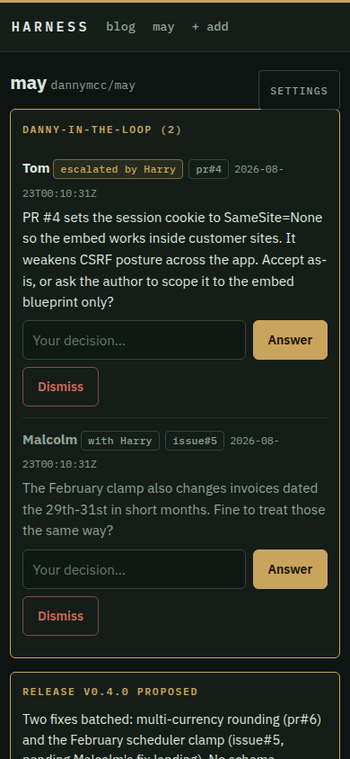

# Harness

[](https://buymeacoffee.com/d3hkz6gwle)

**An AI maintainer for your GitHub repos.** Harness watches the repositories
you point it at, triages issues, reviews pull requests, fixes what it safely
can, keeps the docs honest, and batches everything into sensible versioned
releases — with you approving the important bits from a phone-friendly
dashboard.

Built on the [Claude Agent SDK](https://code.claude.com/docs/en/agent-sdk).
Self-hosted: one Docker container, SQLite, no external services beyond
GitHub, Claude, and (optionally) [ntfy](https://ntfy.sh).

<p align="center">
  
  
</p>

## The section

Harness runs your repos with a small agent organisation, staffed from Spooks:

| Agent | Role | Job |
|---|---|---|
| **Harry** | head of section | Hourly stand-up across every desk. Runs the section through the team leads: blockers become directives, questions come to him first and he escalates to you only what's genuinely yours, staffing requests land on his desk and he decides against spend. Each stand-up carries back the blockers he named at the last one, marked changed or unchanged, so a repeat has to end in a decision rather than a restatement. |
| **Tom, Adam, Ros…** | team leads (one per repo) | Own execution: plan each cycle, action Harry's directives, assign work, request staffing when the backlog outgrows the desk. |
| **Ruth** | analyst | Triages issues against the actual code; reviews PRs for *value* (is this worth having?) as well as quality. |
| **Malcolm** + hires | engineers | Fix bugs and small features in parallel git worktrees, with tests. |
| **Colin** | operations | Runs the release cycle: version bump, CHANGELOG, credited release notes, GitHub Release. |
| **Tariq** | admin | Hourly housekeeping: prunes state, condenses each desk's rolling memory, keeps token usage down. |
| **Zaf** | security | On-demand security review of a repo, triggered from the dashboard. |

**Judgement is agent work; actions are not.** Every push, merge, comment and
release is executed by deterministic code behind per-repo policies (`auto`
vs `approve`), and the test suite is always re-run by the harness itself
before anything lands — an agent claiming success is never taken on trust.
Agents are tool-blocked from `git push`, `gh`, and the network, not just
told to behave.

## What it does

- **Issues** — investigated against the code. Valid, safely-fixable ones are
  fixed in an isolated git worktree with tests; the harness re-runs the
  suite, then lands the branch on your dev branch (rebasing and re-testing
  if dev moved). If it cannot land — the rebase conflicts, the rebased code
  goes red, or dev keeps moving — the commit is pushed to `harness/issue-N`
  on your remote and the item says where it went, so work that already
  passed the tests is never left only on the harness box. A retry that
  resumes the engineer's session comes back to the worktree it left; one
  that starts fresh cuts from dev again, and anything the last attempt left
  behind is kept first, on a local `harness/issue-N-attempt-<n>` branch
  named on the item thread. Where you have given the harness a preview
  command, a change to templates or stylesheets is rendered in a headless
  browser at phone and desktop widths and the screenshots left on the item
  (see **Seeing the app** under [Configuration](#configuration)). Everything
  else gets a drafted reply and waits for you.
- **Pull requests** — merged onto dev locally, tested, then reviewed for
  value and quality. A PR's tests are the contributor's code, so they run in
  a throwaway clone with their own virtualenv and no credentials in the
  environment (see [SECURITY.md](SECURITY.md) for what that does and does not
  protect). Verdicts: merge / needs work / reject, each with a
  courteous drafted review. Nothing merges without passing tests; by default
  nothing merges without your click. **Merge now** on an unreviewed PR skips
  Ruth's opinion when you already know the answer — the harness still merges
  it onto dev in its own clone and runs the suite before landing it, and
  still refuses drafts.
- **Batched releases** — fixes and merges queue on dev. At a threshold (N
  changes or age), or on a set cadence if you would rather release on a
  clock, Colin drafts the release: version bump, CHANGELOG,
  README check, credited notes, then a dev → main PR. You approve; it
  merges, tags, and publishes the GitHub Release. Then it watches the build:
  for a few minutes after the tag is pushed it checks what GitHub Actions
  made of that commit, and tells you which of three things happened — green,
  red, or not known yet. A red build is never reported as a shipped image.
  It pages you, names the run that failed, marks the version on the project
  page, and opens one follow-up issue so the desk fixes the build (one per
  desk, not one per release). A build still running when the check gives up
  is reported as unknown, with the run to look at — never as a pass. A repo
  with no workflow for the commit is simply told as much. If GitHub refuses the
  merge — branch protection, a failing required check, a token without the
  scope — the release comes back as proposed with the reason on the project
  page, so the button is live again and you can see what to fix. One fix
  never means one release. **Release now** — on the project page, or on any
  card on the overview — cuts one without waiting for the threshold,
  including when the only changes on dev landed outside the harness. It shows
  only when there is something to cut, and only until a release is proposed,
  so it is never a dead press; the version bump and the tests happen either
  way. Set `auto release` to `auto` on the repos you want running hands-off
  and the drafted release merges, tags and publishes itself; the tests still
  have to pass first. It is set per repo — the overview marks the repos that
  are on it, and the project page repeats it with whatever sets one off.
  `release schedule` picks which trigger that is: `changes` (the default) is
  the two thresholds, whichever comes first; `daily`, `weekly` or `monthly`
  is a calendar cadence instead — at most one release a window, timed from
  the last release and carrying everything queued since it, with the two
  thresholds ignored. A window with nothing in it passes quietly, and a
  window missed because the desk was off gives one catch-up release rather
  than a run of back-dated ones. **Release now** and Harry's own release
  proposal ignore the cadence and cut immediately either way.
- **Operator-in-the-loop** — any agent can ask a question when a decision
  isn't theirs. It goes to Harry, who rules within minutes on anything in
  the section's remit (engineering judgement, priorities, process); only
  what he escalates reaches your queue and (via ntfy) your phone — with
  one-tap answer buttons when the question has discrete options. A question
  of Harry's own is yours by definition: he cannot rule on himself, so it is
  filed for you straight away rather than sitting in his inbox. You can
  also issue standing directions, desk-wide or per-item, and Harry turns
  them into actions straight away.
- **Your answer moves the item** — answering a question about an issue or a
  PR is an instruction, not a note. Answer **Fix** (or "go ahead", "do it",
  "merge") and it is signed off there and then and an engineer picks it up
  on the next cycle, whatever `fix issues` is set to — saying so is the same
  act as pressing approve. Whichever way it is sent back — the answer, the
  button, or a standing direction — an item held because its last run
  changed nothing or the engineer declined starts a fresh attempt rather
  than resuming that session: there is nothing there to build on, and a
  session that already believes the work is done would only stop again.
  A run held for failing tests still resumes — the engineer has the failure
  in front of it and its own work to hand. **Skip** leaves it waiting on
  you with your reason on the thread; **Won't fix** closes it out. Anything
  else you type is a message rather than a decision, so the item goes back
  to whoever asked, with your answer in front of them — it never sits there
  unread. The wordings that carry a decision are a fixed list in the code
  (`db.ANSWER_ACTIONS`), so nothing is inferred later, and hovering an
  answer button tells you what it will do. While an answer stands, the same
  question about the same item cannot be put to you again for a week: the
  asker is given your answer instead.
- **Close as done** — work that has already landed some other way needs a
  way out. **Close as done**, on the item page, takes it off the board and
  closes the issue on GitHub with the reason attached; it is not the same
  press as **Reject**, which says we are not doing the work. Telling Harry
  to close something out ("close #302, it shipped in v0.38.1") does the
  same thing, without waiting for a release to sweep it up. A pull request
  closed this way leaves our board only — closing someone else's PR isn't
  ours to do.
- **Slash commands** — the same box takes commands as well as prose. Plain
  text goes to Harry to judge; a leading `/` is carried out then and there
  by the same code the buttons run, behind the same policy gates. `/approve
  4`, `/merge pr 8`, `/reject 4`, `/release`, `/tell Malcolm skip the probe`
  (steers their live run), `/stop 12`, `/budget 100`, `/policy fix_issues
  approve`, `/cycle`, `/p may` to jump to a desk, `/?` for the list — which
  also appears under the box as soon as you type a `/`. On a project page
  the desk is the page's; from the overview it is the one in the composer's
  own select, or named first (`/budget may 100`). Anything it can't do —
  an unknown command, a policy key that doesn't exist, an agent with no run
  in flight — says so under the box and changes nothing.
- **Mid-run control** — live transcripts for every agent run, a Stop
  button, and a circuit breaker that holds any item after two consecutive
  failures instead of burning retries. A run counts as a failure when it
  left the item no further forward, which includes the two ways an agent
  can come back clean and empty-handed — declining the work, or reporting
  success while changing nothing — so a run that achieved nothing shows in
  the run list as the failure it was. A held item goes to Harry, not to
  you: he sees both failures and rules — one fresh attempt, or the work
  sent back to the team lead to be broken up (two runs out of turns means
  the item is too big, not broken), or an escalation, which is the only one
  of the three that reaches your phone. He gets one ruling per item; if it
  trips again after it, the item is yours. A sticky strip above the console
  keeps the run's facts in view and moving — messages so far, model,
  elapsed time, and the cost, which the SDK only reports once the run
  ends, so it reads ≈US$0.00 until then rather than a guess. The run list on
  the project page carries the message count alongside the cost too. Say
  something to a running agent and choose when it lands: **Send** goes into
  the session on its next message, **When they finish** files it on the item
  instead, so whoever picks the item up next reads it without the current
  run being derailed.
  If a run ends — stopped, or of its own accord — before it took what you
  sent, the message isn't lost: the finished run page lists it under
  **Undelivered**, to send on as a direction on the item or discard.
- **The item thread** — every agent's findings, plans, notes, test runs and
  your own directions land on one page per item, in order. It can be
  narrowed by kind (rulings, directions, findings/plans, notes,
  events/tests) from plain links, so the filter is part of the URL and a
  shared link shows everyone the same thing; rulings and directions stay
  pinned at the top whatever the filter, since they bind every agent that
  reads the thread. Long entries fold away after twelve lines.
- **Desk memory** — agents bank one-line learnings, recalled into future
  prompts and condensed hourly, so judgement stays consistent without
  prompts growing.
- **Every desk on its own clock** — each repo has its own wake loop, so what
  you do on one desk never queues behind another. Approve a release while a
  second desk's engineers are half an hour into a wave and the merge starts
  on the click, not when that wave ends. A desk still runs one cycle at a
  time: anything that arrives mid-cycle is served on the next pass rather
  than as a second wave over the same checkout. The section's shared
  business — Harry's rulings and directions, housekeeping, the hourly
  stand-up — stays section-wide, on its own clock alongside the desks.
- **Resilience** — API rate/usage limits pause all agent work and resume
  automatically when the limit resets. Agent sessions live on the data
  volume, so a fix interrupted by a restart or an upgrade picks up where it
  left off rather than starting over; if the session has gone for good, the
  same run starts again fresh. A worker heartbeat backs `/health`, the
  container healthcheck, and GUI warnings. Active-hours policy keeps the
  section inside your working day if you want it to.

## Quick start

You need Docker, a GitHub token with `repo` scope, and Claude access —
either a [Claude subscription](https://claude.com) (run `claude setup-token`
anywhere Claude Code is installed) or an Anthropic API key.

```bash
git clone https://github.com/dannymcc/harness.git && cd harness
cp .env.example .env    # fill in CLAUDE_CODE_OAUTH_TOKEN (or an API key),
                        # GH_TOKEN, and HARNESS_OPERATOR_NAME (your name)
docker compose up -d
```

Open http://localhost:8300, click **+** in the nav, and point it at a repo. New
harnesses start conservative: fixes run automatically but land only on your
dev branch; merges, public comments, and releases all wait for your
approval until you loosen the policies in Settings.

**Restarts are safe.** On SIGTERM (a deploy, `docker compose down`,
watchtower) the harness stops starting agent runs, lets the ones in flight
finish — up to `HARNESS_DRAIN_TIMEOUT_S`, default 25 minutes — keeps the GUI
up meanwhile, and only then exits. The compose file sets
`stop_grace_period: 30m` to match; if you use watchtower, give it
`WATCHTOWER_TIMEOUT=30m` too or it will SIGKILL after 10 seconds.

**Keep it private.** The dashboard has no authentication — it approves
merges and releases, so treat it like a shell. Bind it to loopback (the
default compose does), and reach it over a tailnet/VPN or behind an
authenticating reverse proxy. Never expose it to the public internet. So that
no other site can drive it from your browser, every state-changing request
that a browser marks as coming from elsewhere is refused; requests with no
origin headers at all (the ntfy buttons, `curl`, health checks) still work.

### The overview at a glance

The overview opens on what needs you: the composer, anything awaiting your
decision, the repo cards and the section roster, with total spend at the top.
The event log lives behind the **recent activity** tab beside them. The tabs
are plain links (`/?tab=activity`), so the URL says what you are looking at —
it bookmarks, it survives a reload, and an unknown value just gives you the
default view. The composer and the question queue sit above the tab strip, so
they are there whichever tab you are on.

### Notifications

Set `HARNESS_NTFY_TOPIC` (and `HARNESS_PUBLIC_URL`, reachable from your
phone) to get pushes for escalated questions, release proposals, the held
items Harry could not settle himself, and usage-limit pauses — with one-tap
answer buttons. On the public ntfy.sh server the topic name is effectively
a password; pick something unguessable. The dashboard also installs as a PWA.

### Light and dark

The dashboard opens light, whatever the operating system prefers. The **Dark**
/ **Light** button in the nav switches palette; the choice is kept in a
`theme` cookie for a year, so it survives reloads and is remembered per
browser. It is a plain form post, so it works with JavaScript off and the
page arrives already in the right palette — no flash on load.

## Configuration

Environment (see `.env.example`): `HARNESS_MODEL` (default `claude-opus-5`),
`HARNESS_ADMIN_MODEL` (cheap model for housekeeping), `HARNESS_TRIAGE_MODEL`
(mid-tier model for triage and PR review, default `claude-sonnet-5`), poll interval, per-run
budget cap, timezone, ntfy settings. `HARNESS_DB_SYNCHRONOUS` sets SQLite's
durability pragma and is best left unset — that is SQLite's `FULL`, an fsync
per commit, which is what state you cannot rebuild deserves.

Per-repo policies, editable live in Settings:

| Policy | Default |
|---|---|
| fix issues (and land on dev) | auto (also: `lead` — the team lead's plan is the sign-off) |
| leads open tracking issues from their plan | auto (at most 6 of a desk's own filings open and unworked at once; `off` to disable). Also gates the follow-up issue opened when a release's CI goes red |
| merge community PRs | approve |
| merge dependabot PRs | approve |
| post comments/reviews publicly | approve |
| auto release | approve — it prepares the release and waits for your click (`auto` — it drafts, tests, merges to main and tags without asking) |
| release schedule | changes (also: `daily`, `weekly`, `monthly` — one release a window, timed from the last release, thresholds ignored) |
| release batch size / max age | 3 changes / 7 days (on the `changes` schedule) |
| active hours | always (or `HH-HH` local; anything you trigger yourself ignores it) |
| daily budget (USD) | 30 — the desk stops starting agent work once it has spent this much in the last 24 hours |

Repo expectations (all configurable per harness): a dev branch flowing to a
main branch by PR, a version string in a file, and a test command. The
defaults match a Flask-style project (`config.py`, pytest). Setup and test
commands run in a deliberately bare environment — `PATH`, locale, `TERM`,
a scratch `HOME`/`TMPDIR`, and nothing else — because on a community PR they
are the contributor's code. A suite that needs its own variables (a private
package index, say) has to set them itself. The test command doubles as the
one command the triage and review agents are allowed to run — they read text
from the internet, so their shell is an allowlist of that command plus
read-only `git` (see [SECURITY.md](SECURITY.md)).

**Seeing the app.** A stylesheet that contains the right strings still renders
a page you cannot use on a phone, and no amount of reading the diff will say
so. Give a harness a **preview command** — on the add form, or in Settings
afterwards — and the engineer gets a way to look:

```sh
python harness/render.py --command 'DEMO_MODE=true python app.py' \
    --routes / /projects --viewport 412x915 --viewport 1280x800 \
    --out .harness/screenshots
```

It starts the app, opens each route in headless Chromium at each viewport,
saves a PNG per route per width, and reports what the CSS text cannot: a page
wider than its viewport, elements past the right edge outside any declared
scroll box, and console errors. Anyone changing templates or static assets is
told to run it on the routes the issue names and to open the screenshots
before calling the work done. They land in `.harness/screenshots` in the
worktree, excluded from the commit, so they are evidence for the run rather
than files pushed to your repo. Leave the preview command empty — the default
— and none of this applies: nothing is rendered and nobody is asked for
screenshots. The command is yours, not the repository's: it is set on the
harness, so a pull request cannot choose what gets started. It should leave
the app answering on `http://127.0.0.1:8000` with demo data and no login in
the way. Playwright and Chromium ship in the harness image; from a checkout,
`pip install playwright && playwright install chromium`.

Costs shown in the GUI are the SDK's API-equivalent estimates (`≈US$`) — on
a subscription plan nothing is billed per token; read them as a burn meter.

The footer names the build you are looking at, as `v<version> (abc1234)`. The
number comes from `VERSION` in `harness/config.py` (bumped by the release
process, not by hand) and the SHA from, in order, `HARNESS_GIT_SHA`, the stamp
the image build writes to `harness/_build_sha`, or `git HEAD` of the checkout
it is running from. If none of those can answer, the footer says
`v<version> (unknown build)` rather than implying a commit it doesn't know.

## Development

```bash
python -m venv venv && . venv/bin/activate
pip install -r requirements.txt
export CLAUDE_CODE_OAUTH_TOKEN=... GH_TOKEN=...
python run.py            # GUI + worker on :8300
```

Run the tests with `python -m pytest -q`. To render a managed project's pages
from a checkout you also need the browser itself — `playwright install
chromium`; the harness image already has it. State lives in `data/` (SQLite,
clones, worktrees, per-run transcripts). Deleting `data/repos`,
`data/worktrees`, `data/pr-runs` or `data/sandbox` is always safe — they're
rebuilt; deleting a worktree an item is still working in only costs that
item its edits, and the next attempt starts from `origin/dev`.

`data/claude-home` holds the Agent SDK's own session transcripts: in the
container `~/.claude` is symlinked there at boot, so a fix cut off by a
restart resumes its session rather than starting over. It sits inside the
existing `./data` mount, so no extra volume is needed. Deleting it only
costs in-flight sessions their memory — the next attempt starts fresh. On a
development machine an existing `~/.claude` is left alone.

A resumed fix keeps the worktree it left behind rather than cutting the
branch from `dev` again: the engineer comes back to its own edits. Only a
fresh attempt (or a resume whose worktree has been deleted) resets the tree
to `origin/dev`, and then the last attempt's work is parked on
`harness/issue-N-attempt-M` and named both on the item thread and in the
engineer's own prompt. Housekeeping's three-day sweep of idle worktrees
leaves alone any worktree whose item is still in play, so an item held for
days waiting on an answer still comes back to its own edits; the hourly
summary says how many it kept.

Harness can maintain itself — add this repo as a harness with version file
`harness/config.py`, version pattern `VERSION\s*=\s*"(?P<version>[^"]+)"`,
and test command `python -m pytest -x -q`. We do.

## Licence

[MIT](LICENSE). Named for the thing that keeps a working animal pointed in
the right direction while it does the pulling.
